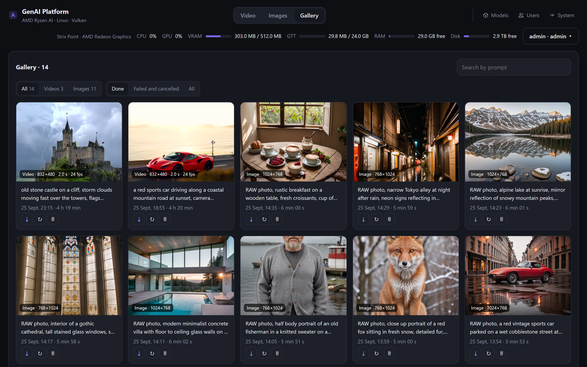
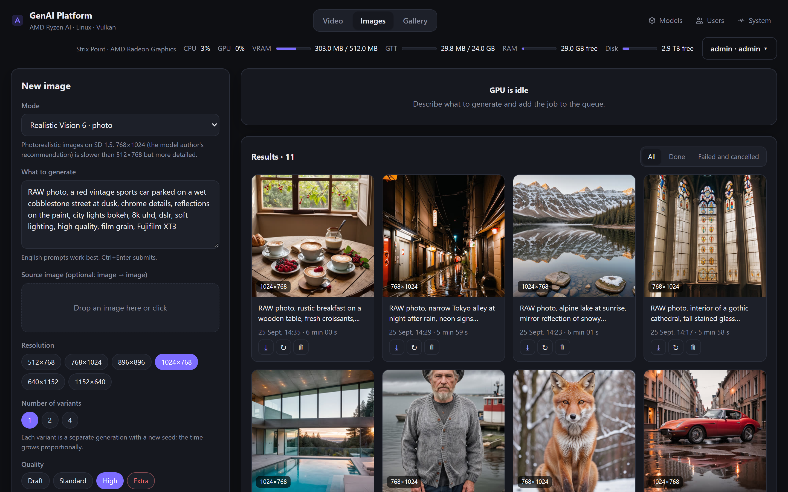
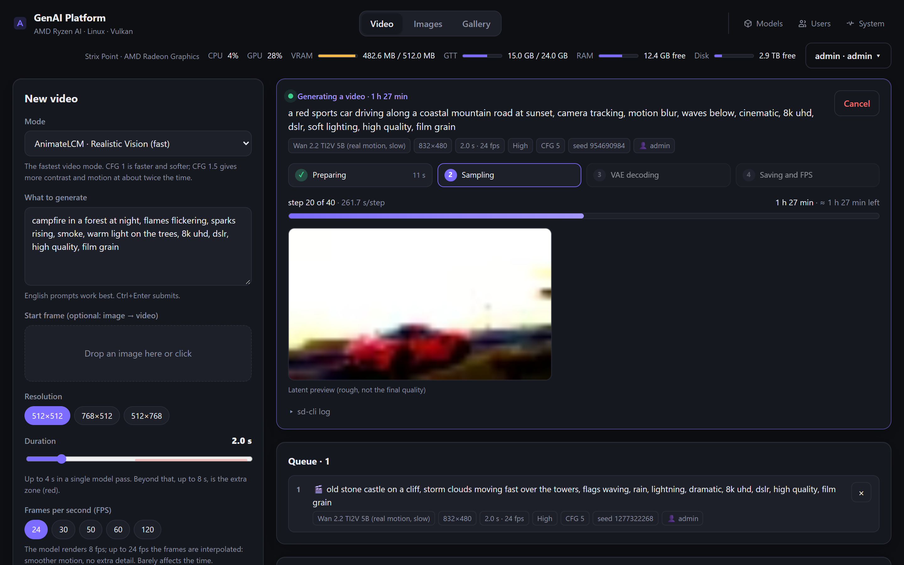
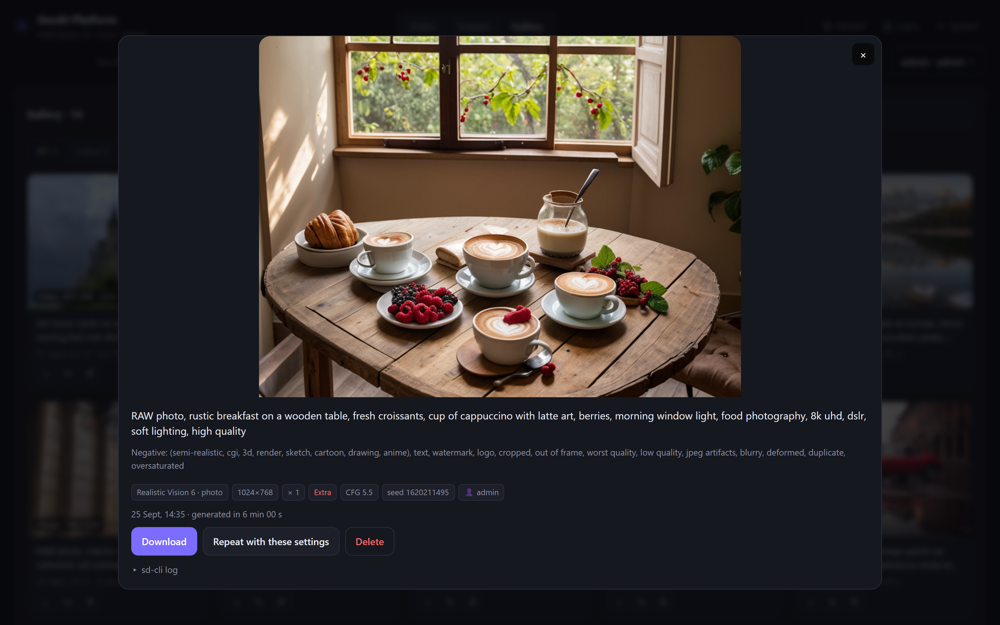
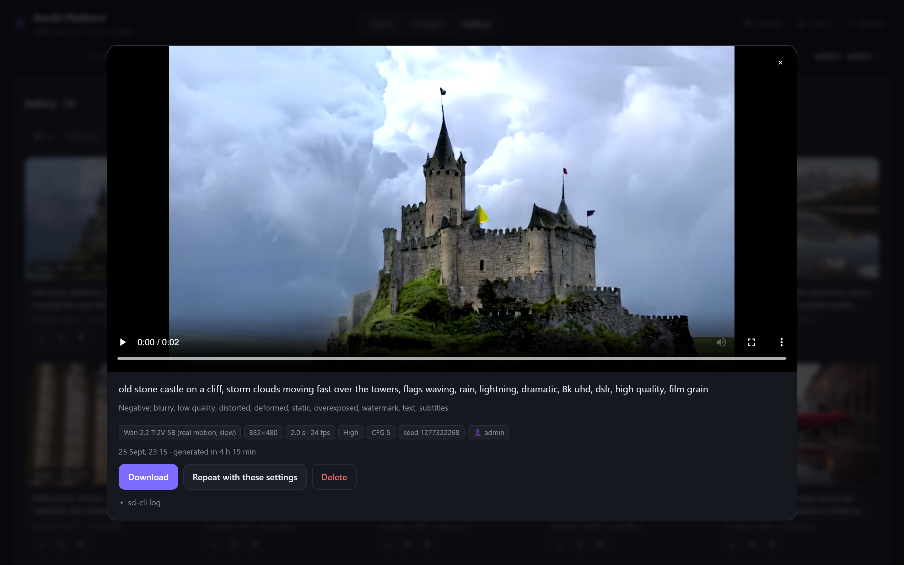
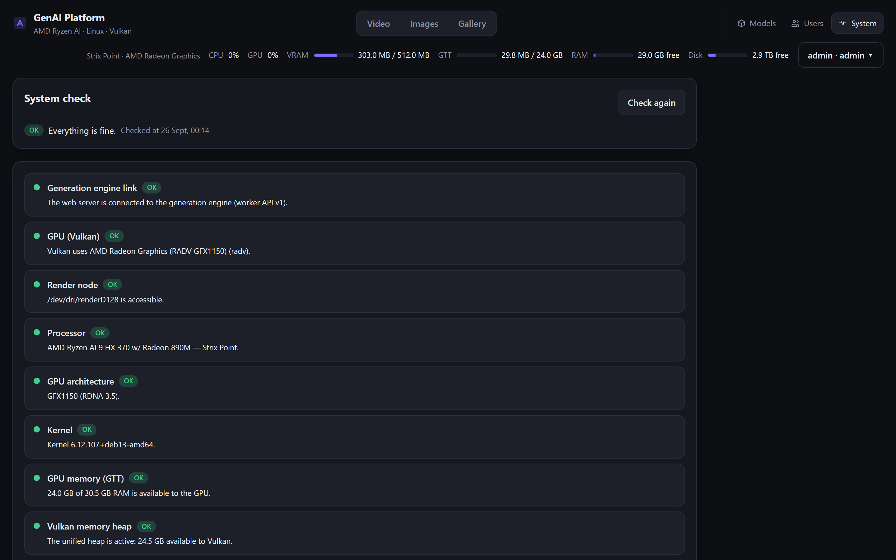
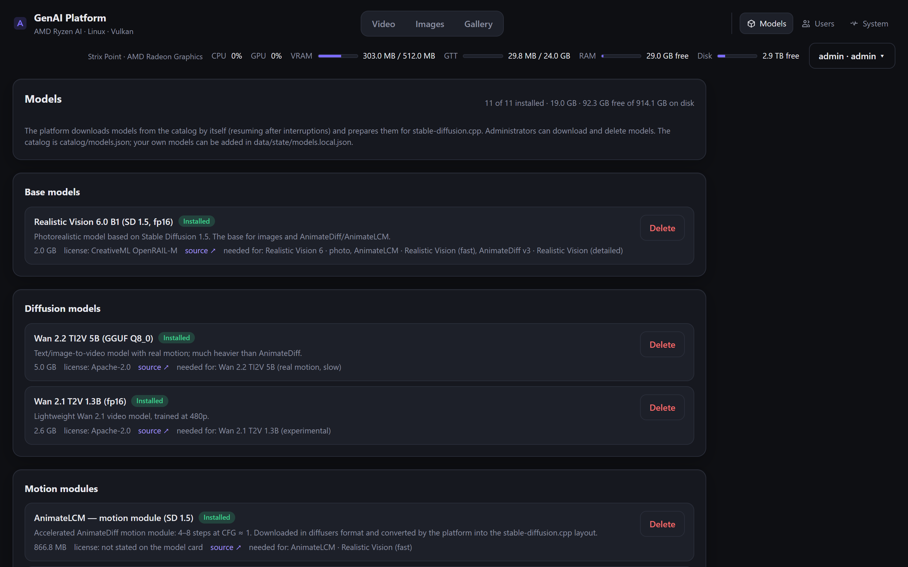

# AMD AI Linux GenAI Platform

A self-hosted platform for local generative content (video, images, and more to come) on **AMD Ryzen AI** mini PCs and laptops running **Linux**. Everything runs on the integrated Radeon GPU through **Vulkan (Mesa RADV)** — no ROCm required. It ships a web UI with sign-in, a job queue, live progress, a gallery, and a model manager that downloads and removes models by itself.

The UI is available in English (default), Ukrainian and Russian.

## Features

- **Video:** text-to-video and image-to-video. AnimateLCM (the fastest), AnimateDiff v3 (more detailed), Wan 2.2 5B (coherent motion, for Strix Halo). Output FPS of 24/30/50/60/120 via motion interpolation. Every model pass stays within what the model was trained on (AnimateDiff 16 frames, Wan 121); **longer videos** are built from several chained passes (AnimateDiff up to 8 s, Wan 2.2 up to 10 s). Going beyond the trained length or the tested sizes is possible, with a warning. **Extra quality** uses twice the steps of High.
- **Images:** photorealistic images with Realistic Vision 6 (SD 1.5), several variants at once, image-to-image.
- **Queue and progress:** jobs run strictly one at a time (there is one GPU). Stages, steps, speed, time left, a latent preview and a live log are shown.
- **Gallery:** everything generated, videos and images together, with filters by kind, status and author and a search by prompt. A failed or cancelled job can be **restarted** as it was (same parameters and seed); "repeat" fills the form with a job's settings.
- **Time estimates:** before the first run of a mode the form scales a real reference measurement to this GPU (compute units × clock); afterwards it uses this machine's own history.
- **Updates without interruptions:** the UI/API (`web`) and the GPU engine (`worker`) are separate containers; `./scripts/update.sh` restarts the web part at once and the engine only after the current job.
- **Generation telemetry (optional):** a JSON document per job with the system snapshot (OS, kernel, runtime, CPU, GPU, drivers, clocks), all job parameters and per-phase hardware metrics (utilization, memory, swap, clocks, power, temperatures), with a size limit. Stays on the server. See [docs/telemetry.md](docs/telemetry.md).
- **Models:** a catalog with sources, sizes and licenses. One-click downloads with resume, conversion into the stable-diffusion.cpp format, deletion. A mode without its models offers to download them.
- **First-run setup:** while nothing is usable yet, the administrator gets a checklist of model packs with sizes and explanations; the required base is locked, recommendations depend on the hardware.
- **System check:** the platform checks itself — the link to the engine, GPU via Vulkan, render node access, CPU family and GPU architecture, kernel, GTT size, the unified Vulkan heap, memory for heavy modes, swap, disk, engine, NPU — and shows concrete advice with copyable commands. Critical problems show a banner for administrators and are logged at startup.
- **Users:** the first administrator is created on first start, then it is sign-in only (scrypt passwords). The administrator adds users; admin/user roles, everyone owns their jobs.
- **Start templates:** on open, the form is filled with one of 10 hidden templates (car, animal, person, architecture, nature…) with settings tuned for maximum quality.
- **Extensible:** modes and models are described in JSON (`catalog/`); your own are added without a rebuild via `data/state/*.local.json`.

## Screenshots

Taken on the reference machine (Radeon 890M) at the size of a 13" laptop screen (1440×900, 2× density). All results were generated by the platform itself: Realistic Vision 6 at 768×1024 / 1024×768 with Extra quality (80 steps, 4–6 min per image) and Wan 2.2 5B at 832×480, High quality (4 h 20 min per 2 s clip). See [docs/benchmarks.md](docs/benchmarks.md).

> **Note:** the screenshots show the interface at the time of writing (September 2026). The platform is in active development, so the current UI may differ considerably: layout, sections, controls and texts change between versions.

| | |
|---|---|
| [](docs/screenshots/gallery.png) **Gallery:** videos and images together, filters, search | [](docs/screenshots/image-studio.png) **Images:** the form and the latest results |
| [](docs/screenshots/video-studio.png) **Video:** a Wan 2.2 job with stages, speed, time left, latent preview and the queue | [](docs/screenshots/viewer-image.png) **Viewer:** the result with its prompt and parameters |
| [](docs/screenshots/viewer-video.png) **Video viewer:** a Wan 2.2 clip | [](docs/screenshots/system.png) **System check:** GPU, GTT, the unified Vulkan heap, engine |
| [](docs/screenshots/models.png) **Models:** catalog, sizes, licenses, what uses what | |

## Hardware

Built for the **Ryzen AI** lineup (RDNA 3.5 + XDNA 2): Strix Point (Ryzen AI 9 HX 370/365 — Radeon 890M/880M), Krackan Point (Ryzen AI 7/5 — Radeon 860M/840M), Strix Halo (Ryzen AI MAX/MAX+ — Radeon 8040S/8050S/8060S). It works on any GPU with Vulkan, but the settings and measurements target these APUs.

Developed and measured on a **Sapphire EDGE AI 370**: Ryzen AI 9 HX 370, Radeon 890M, 32 GB LPDDR5X, 512 MB UMA, 24 GB GTT, Debian 13, kernel 6.12, Mesa 25.0.7. Details in [docs/hardware.md](docs/hardware.md), measurements in [docs/benchmarks.md](docs/benchmarks.md).

The NPU (XDNA) is not used yet: on Linux it has no support for diffusion video models. See [docs/hardware.md](docs/hardware.md#npu-xdna).

## Quick start

Requirements: Linux (tested on Debian 13; Ubuntu 24.04+ works too), kernel 6.10+, Docker with compose, ~20–40 GB of disk for models.

```bash
git clone https://github.com/Octanium91/amd-ai-linux-genai-platform.git
cd amd-ai-linux-genai-platform
./scripts/setup.sh --install     # host checks, Mesa/Vulkan packages, .env
docker compose up -d --build     # the first build takes ~5–10 minutes (stable-diffusion.cpp is compiled)
./scripts/check-gpu.sh           # the worker must see RADV and a Vulkan heap the size of GTT
```

To update later, run `./scripts/update.sh` (or `./scripts/update.sh --pull` to `git pull` first). It rebuilds the images, restarts the web container at once and the generation engine only after the current job, so updates never interrupt a generation. See [docs/architecture.md](docs/architecture.md#containers-and-updates).

Open `http://<host>:7860`. On first start there are no users, so the platform offers to **create the administrator** (username and password). Do it right after starting: until then, anyone on the network can see that form. After that only sign-in is available; the administrator adds other users in the Users section.

While no models are installed, the administrator sees the **first-run setup screen**: model packs with an explanation of what each enables and its size. The Realistic Vision 6 + VAE base is needed by every mode, so its checkbox is grey and cannot be cleared. Recommended packs are pre-selected for the hardware (Wan 2.2 only on Strix Halo). After "Download selected" the Models section opens with the progress; models can be added or removed there later.

There are three independent host directories, set in `.env`: models — `MODELS_PATH` (`./models`), generated videos and images — `OUTPUT_PATH` (`./output`), users, history and logs — `DATA_PATH` (`./data`). None of them are in the image, so rebuilds and updates never touch them. Each can live on its own disk.

GTT (the memory the GPU can use) is the key parameter for video. If `setup.sh` warns that it is too small, enlarge it with a kernel parameter, see [docs/hardware.md](docs/hardware.md#memory-uma-gtt-and-the-vulkan-heap).

## Documentation

| Document | Contents |
|---|---|
| [docs/hardware.md](docs/hardware.md) | Ryzen AI lineup, reference machine, BIOS, GTT, Vulkan, NPU |
| [docs/models.md](docs/models.md) | Model and mode catalog, licenses, templates, adding your own |
| [docs/benchmarks.md](docs/benchmarks.md) | Speed measurements and what affects them |
| [docs/architecture.md](docs/architecture.md) | How the platform works, data layout, API, security, i18n |
| [docs/telemetry.md](docs/telemetry.md) | Generation telemetry: what is collected, format, units |
| [docs/moving.md](docs/moving.md) | Moving to another disk or server, backup and restore |
| [docs/troubleshooting.md](docs/troubleshooting.md) | Common problems and fixes |

## Security

The UI is password-protected but meant for a home or office network. For internet access, put an HTTPS proxy (Caddy, nginx, Traefik) in front of it and set `COOKIE_SECURE=true`, `TRUST_PROXY=true`. See [docs/architecture.md](docs/architecture.md#security).

## License

The platform code is licensed under [MIT](LICENSE). The models it downloads come under their own licenses (CreativeML OpenRAIL-M, Apache-2.0, MIT and others), see [docs/models.md](docs/models.md). Complying with those licenses when using the results is the user's responsibility.

## Acknowledgements

- [stable-diffusion.cpp](https://github.com/leejet/stable-diffusion.cpp) (ggml, Vulkan backend) — the generation engine.
- The models belong to their authors and are distributed under their licenses. The platform downloads them from Hugging Face using the links in [catalog/models.json](catalog/models.json), see [docs/models.md](docs/models.md).
