# AMD AI Linux GenAI Platform

A self-hosted platform for local generative images and video on **AMD Ryzen AI** mini PCs and laptops running **Linux**. Everything runs on the integrated Radeon GPU through **Vulkan (Mesa RADV)** — no ROCm required. It ships a web UI with sign-in, task-based creation (create, rework, change a part, upscale, animate, put a person into a video, change a video), a job queue with live progress, a library of results, an optional AI prompt assistant and a model manager that downloads and removes models by itself.

The UI is in English (default), Ukrainian and Russian, in a dark (default) or light theme or following the system, and works on laptops and phones.

## Features

**Creating**

- **Task first.** The form starts with what you want to do, and shows only the models that can do it:
  - images: **Create**, **Rework a photo** ("how much to change" slider, the size follows the photo), **Change a part** (paint over it with a brush; the rest of the photo stays pixel-exact), **Remove background** (BiRefNet finds the subject in seconds on the CPU, "keep" and "remove" brushes fix the edges, a PNG with transparency is downloaded), **Upscale** (Real-ESRGAN ×4);
  - video: **Create**, **Animate a photo** (the photo is the first frame), **Put a person in** (a person or object from a photo in a new video) and **Change a video** (the motion of your video with a new look, as contours or recoloring; both on Wan 2.1 VACE, experimental).
- **Image models:** Realistic Vision 6 (SD 1.5, ~40 s), RealVisXL V5 (SDXL at 1024 px, 2 min 40 s; also a 5–8-step Lightning variant, 48 s) and Z-Image Turbo (a 6B model in 8 steps that follows natural-language descriptions and renders text, 2 min 50 s). Times are for one 1024×1024 image on a Radeon 890M.
- **Video models:** AnimateLCM (the fastest), AnimateDiff v3 (more detailed), Wan 2.2 5B (coherent motion, for Strix Halo), Wan 2.1 VACE 1.3B. Every model pass stays within what the model was trained on (AnimateDiff 16 frames, Wan 121); **longer videos** are stitched from several passes (AnimateDiff up to 7.6 s, Wan 2.2 up to 10 s), with exactly the requested length. Output at 24–120 fps via motion interpolation.
- **Models as cards** with the time per result on this machine, and badges for experimental modes, downloads needed and memory limits. Before a mode's first run the time comes from a real reference measurement scaled to this GPU (compute units × clock, read from the driver); afterwards from this machine's own history.
- **Prompt assistant (optional):** "✦ Improve with AI" in the prompt box. A language model on an [Ollama](https://ollama.com) server turns an idea in any language into a prompt written for the selected model: tags within CLIP's 75 tokens plus the model's quality tags for SD 1.5 / SDXL, flowing sentences with motion and camera for Wan and Z-Image. It knows the task (for Change a part it describes only the painted area). See [docs/models.md](docs/models.md#prompt-assistant).
- **Plain settings:** shape and size (tested sizes first), length or variations, quality; "More settings" holds smoothness, what to avoid and the variation number, and an Expert group the engine's own parameters. The time estimate and the Generate button stay in view.

**Results**

- **The latest result large, with what to do next:** download, upscale ×4, change a part, rework, animate it into a video, or edit and run again. The same actions are in the viewer.
- **Library:** everything generated, filters by kind, status and author, search by prompt. A failed or cancelled job can be run again as it was.
- **Queue and progress:** one job at a time (one GPU). A status pill in the header shows the GPU (idle, or progress and time left, the queue, overheating) and opens the queue; the running job shows a rough live preview, one plain progress line, and its stages and engine log under Details.

**Running it**

- **Updates without interruptions:** the UI/API (`web`) and the GPU engine (`worker`) are separate containers; `./scripts/update.sh` restarts the web part at once and the engine only after the current job.
- **Models:** a catalog with sources, sizes and licenses. One-click downloads with resume, conversion into the stable-diffusion.cpp format, deletion. A mode without its models offers to download them; on first start the administrator picks model packs from a checklist.
- **System check and hardware:** the platform checks itself (engine link, GPU via Vulkan, render node, CPU and GPU generation, kernel, GTT and TTM, the unified Vulkan heap, memory, swap, disk, NPU) and gives concrete advice with copyable commands. The System page shows CPU, GPU, memory and disk with load, clocks, temperatures and the firmware's throttling state.
- **Generation telemetry (optional):** a JSON document per job with the system snapshot, all parameters and per-phase hardware metrics (utilization, memory, swap, clocks, power, temperatures, throttle counters), with a size limit and an anonymized download. Stays on the server. See [docs/telemetry.md](docs/telemetry.md).
- **Users:** the first administrator is created on first start, then it is sign-in only (scrypt passwords). The administrator adds users; admin/user roles, everyone owns their jobs.
- **Extensible:** modes and models are described in JSON (`catalog/`); your own are added without a rebuild via `data/state/*.local.json`.

## Screenshots

Taken on the reference machine (Radeon 890M) at the size of a 13" laptop screen (1440×900, 2× density) and a phone (390×844, 3×). All results were generated by the platform itself (RealVisXL V5, Z-Image Turbo, AnimateLCM, AnimateDiff v3, Wan 2.1 VACE, Real-ESRGAN); see [docs/benchmarks.md](docs/benchmarks.md).

> **Note:** the screenshots show the interface at the time of writing (September 2026). The platform is in active development, so the current UI may differ considerably: layout, sections, controls and texts change between versions.

| | |
|---|---|
| [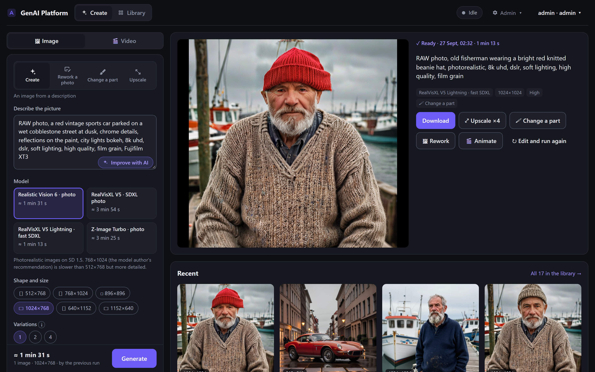](docs/screenshots/create-image.png) **Create:** task, prompt with the AI assistant, models with the time per result; the latest result with what to do next | [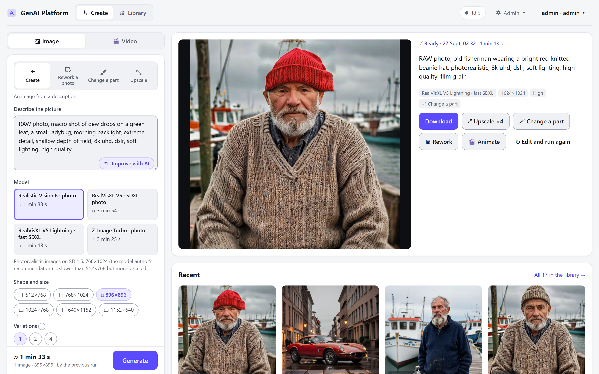](docs/screenshots/create-image-light.png) **Light theme** |
| [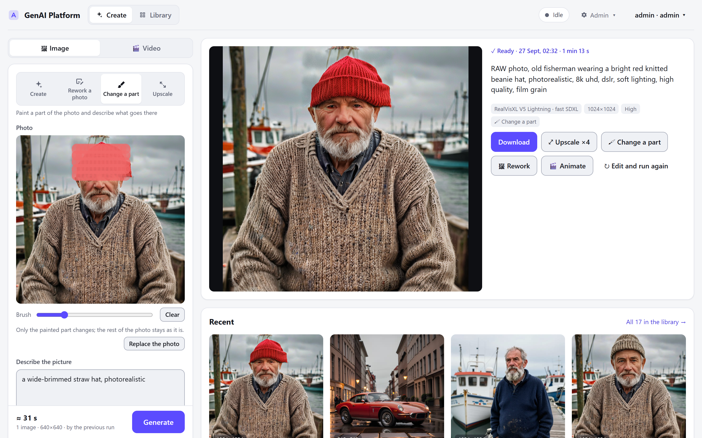](docs/screenshots/change-part.png) **Change a part:** paint over the hat, describe what goes there | [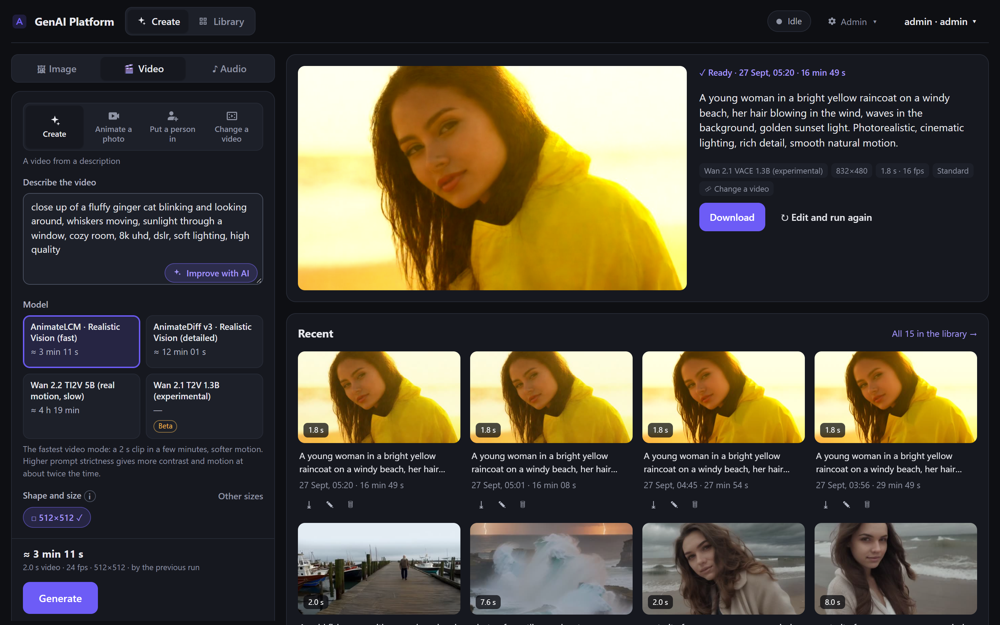](docs/screenshots/create-video.png) **Video:** a clip changed with Wan 2.1 VACE (the motion of an uploaded video, a new look) |
| [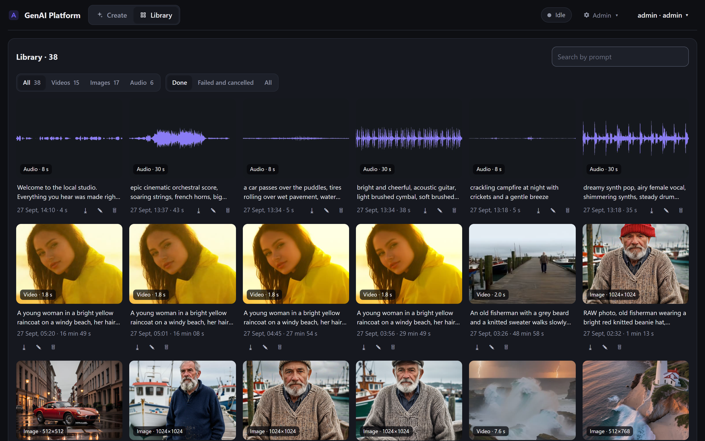](docs/screenshots/library.png) **Library:** everything generated, filters, search | [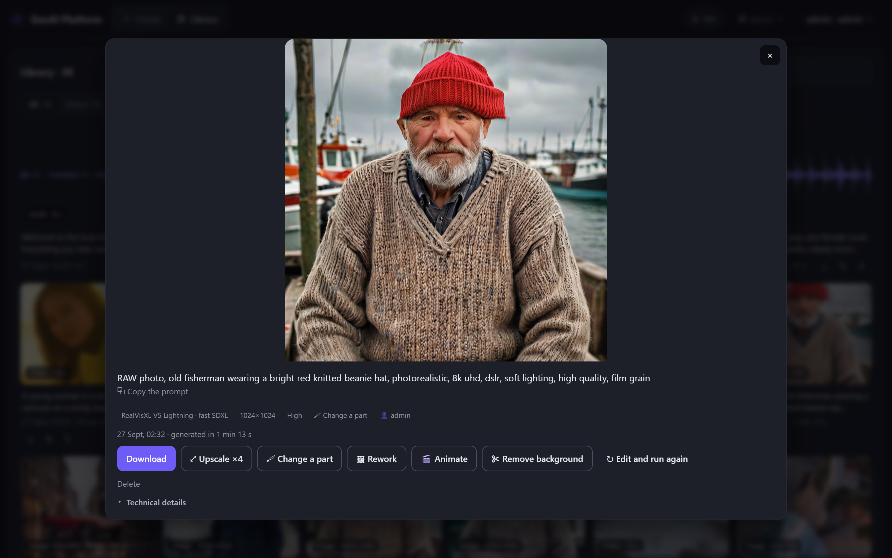](docs/screenshots/viewer.png) **Viewer:** the result and its follow-up actions |
| [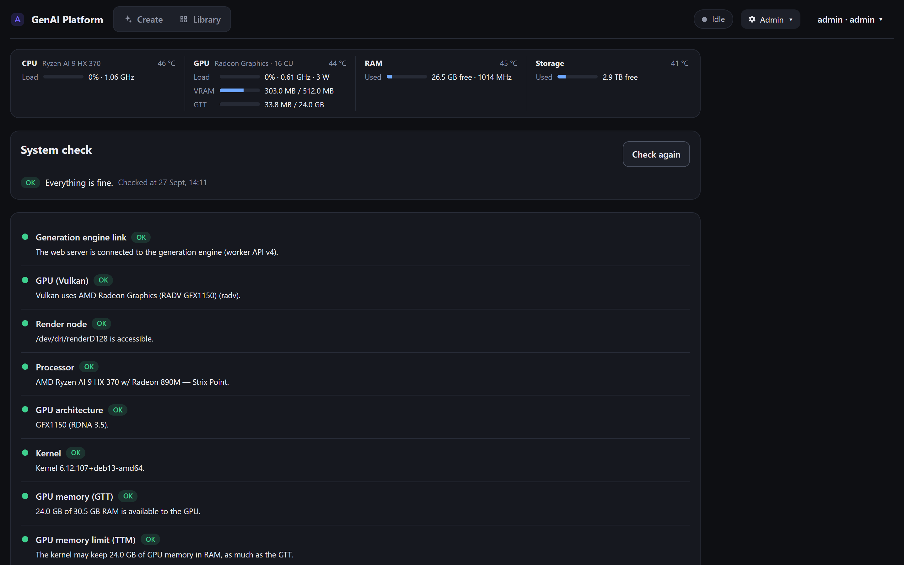](docs/screenshots/system.png) **System:** hardware at a glance and the self-check | [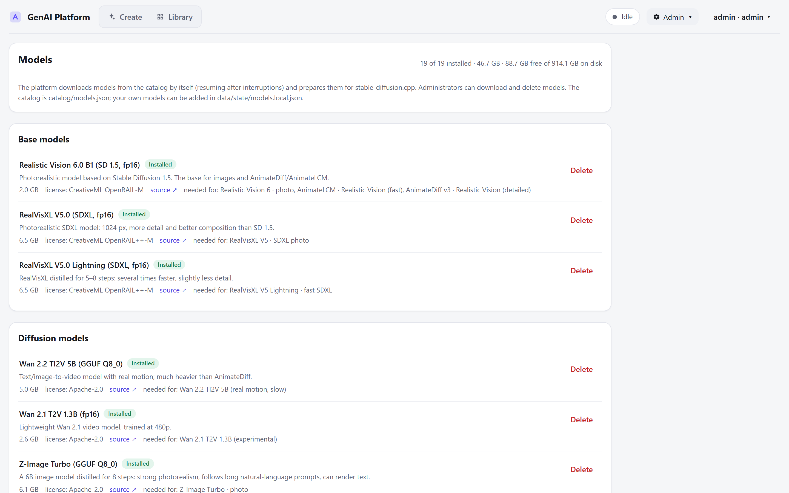](docs/screenshots/models.png) **Models:** catalog, sizes, licenses, what uses what |
| [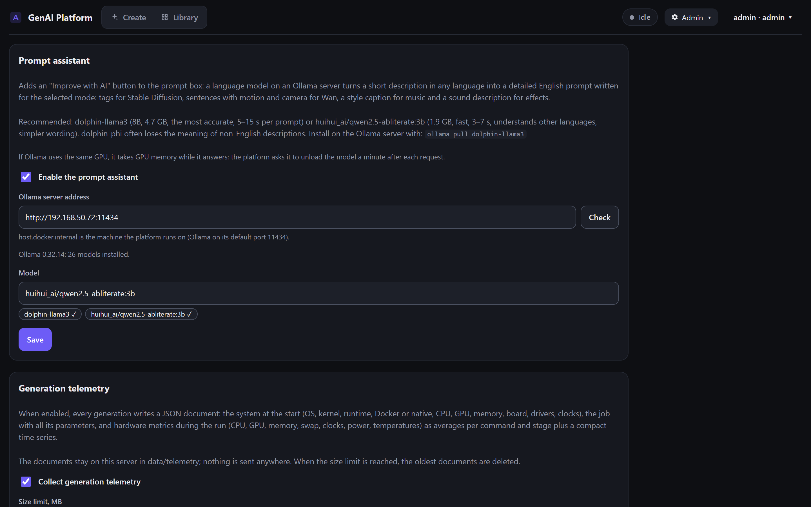](docs/screenshots/settings.png) **Settings:** the prompt assistant (Ollama) and telemetry | [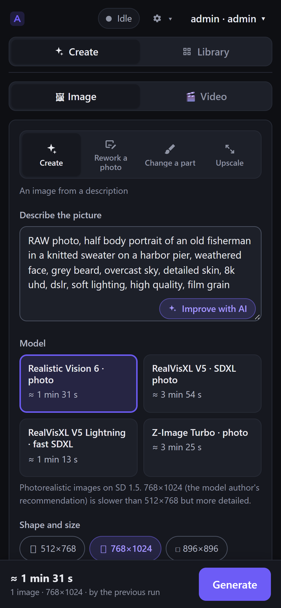](docs/screenshots/phone-create.png) [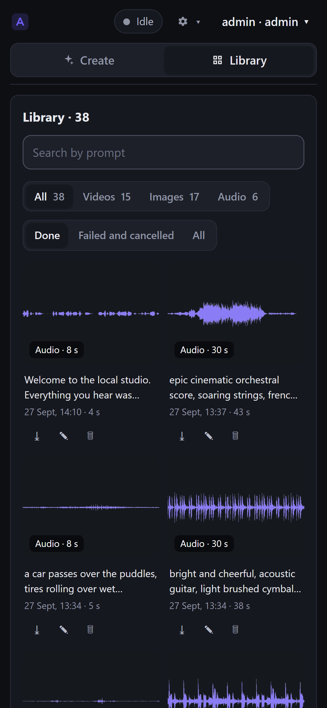](docs/screenshots/phone-library.png) **On a phone** |

## Hardware

Built for the **Ryzen AI** lineup (RDNA 3.5 + XDNA 2): Strix Point (Ryzen AI 9 HX 370/365 — Radeon 890M/880M), Krackan Point (Ryzen AI 7/5 — Radeon 860M/840M), Strix Halo (Ryzen AI MAX/MAX+ — Radeon 8040S/8050S/8060S). It works on any GPU with Vulkan, but the settings and measurements target these APUs.

Developed and measured on a **Sapphire EDGE AI 370**: Ryzen AI 9 HX 370, Radeon 890M, 32 GB LPDDR5X, 512 MB UMA, 24 GB GTT, Debian 13, kernel 6.12, Mesa 25.0.7. Details in [docs/hardware.md](docs/hardware.md), measurements in [docs/benchmarks.md](docs/benchmarks.md).

The NPU (XDNA) is not used yet: on Linux it has no support for diffusion video models. See [docs/hardware.md](docs/hardware.md#npu-xdna).

## Quick start

Requirements: Linux (tested on Debian 13; Ubuntu 24.04+ works too), kernel 6.10+, Docker with compose, ~20–40 GB of disk for models.

```bash
git clone https://github.com/Octanium91/amd-ai-linux-genai-platform.git
cd amd-ai-linux-genai-platform
./scripts/setup.sh --install     # host checks, Mesa/Vulkan packages, .env
docker compose up -d --build     # the first build takes ~5–10 minutes (stable-diffusion.cpp is compiled)
./scripts/check-gpu.sh           # the worker must see RADV and a Vulkan heap the size of GTT
```

To update later, run `./scripts/update.sh` (or `./scripts/update.sh --pull` to `git pull` first). It rebuilds the images, restarts the web container at once and the generation engine only after the current job, so updates never interrupt a generation. See [docs/architecture.md](docs/architecture.md#containers-and-updates).

Open `http://<host>:7860`. On first start there are no users, so the platform offers to **create the administrator** (username and password). Do it right after starting: until then, anyone on the network can see that form. After that only sign-in is available; the administrator adds other users in the Users section.

While no models are installed, the administrator sees the **first-run setup screen**: model packs with an explanation of what each enables and its size. The Realistic Vision 6 + VAE base is needed by every mode, so its checkbox is grey and cannot be cleared. Recommended packs are pre-selected for the hardware (Wan 2.2 only on Strix Halo). After "Download selected" the Models section opens with the progress; models can be added or removed there later.

There are three independent host directories, set in `.env`: models — `MODELS_PATH` (`./models`), generated videos and images — `OUTPUT_PATH` (`./output`), users, history and logs — `DATA_PATH` (`./data`). None of them are in the image, so rebuilds and updates never touch them. Each can live on its own disk.

GTT (the memory the GPU can use) is the key parameter for video. If `setup.sh` warns that it is too small, enlarge it with a kernel parameter, see [docs/hardware.md](docs/hardware.md#memory-uma-gtt-and-the-vulkan-heap).

## Documentation

| Document | Contents |
|---|---|
| [docs/hardware.md](docs/hardware.md) | Ryzen AI lineup, reference machine, BIOS, GTT, Vulkan, NPU |
| [docs/models.md](docs/models.md) | Model and mode catalog, licenses, templates, adding your own |
| [docs/benchmarks.md](docs/benchmarks.md) | Speed measurements and what affects them |
| [docs/architecture.md](docs/architecture.md) | How the platform works, data layout, API, security, i18n |
| [docs/telemetry.md](docs/telemetry.md) | Generation telemetry: what is collected, format, units |
| [docs/moving.md](docs/moving.md) | Moving to another disk or server, backup and restore |
| [docs/troubleshooting.md](docs/troubleshooting.md) | Common problems and fixes |

## Security

The UI is password-protected but meant for a home or office network. For internet access, put an HTTPS proxy (Caddy, nginx, Traefik) in front of it and set `COOKIE_SECURE=true`, `TRUST_PROXY=true`. See [docs/architecture.md](docs/architecture.md#security).

## License

The platform code is licensed under [MIT](LICENSE). The models it downloads come under their own licenses (CreativeML OpenRAIL-M, Apache-2.0, MIT and others), see [docs/models.md](docs/models.md). Complying with those licenses when using the results is the user's responsibility.

## Acknowledgements

- [stable-diffusion.cpp](https://github.com/leejet/stable-diffusion.cpp) (ggml, Vulkan backend) — the generation engine.
- The models belong to their authors and are distributed under their licenses. The platform downloads them from Hugging Face using the links in [catalog/models.json](catalog/models.json), see [docs/models.md](docs/models.md).
